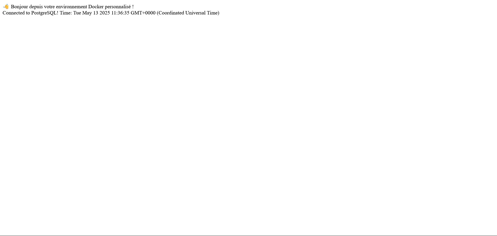
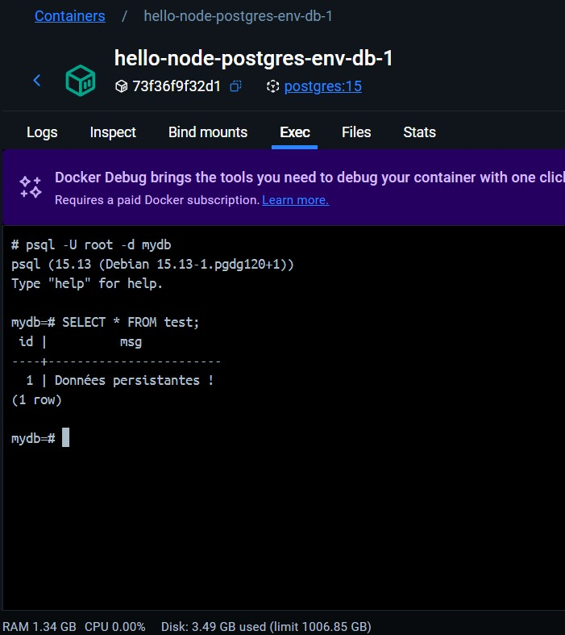

# Projet Docker - Conteneurisation d'applications Node.js

Ce projet comprend trois (TP) démontrant comment conteneuriser des applications Node.js avec Docker, depuis une simple application jusqu'à un environnement multi-conteneurs personnalisable.

## Structure du projet

Le projet est organisé en trois parties :

1. **TP2** - Application Node.js simple conteneurisée
2. **TP3** - Orchestration multi-conteneurs (Node.js + PostgreSQL)
3. **TP4** - Environnement multi-conteneurs personnalisable (variables d'environnement, volumes)

## TP2 - Conteneuriser une application Node.js avec Docker

Une application Express qui affiche un message dans le navigateur.


### Installation et lancement

1. Naviguez dans le dossier TP2 :

   ```bash
   cd chemin/vers/TP2
   ```

2. Construisez l'image Docker :

   ```bash
   docker build -t hello-node-app .
   ```

3. Lancez le conteneur :

   ```bash
   docker run -d -p 3000:3000 --name my-node-container hello-node-app
   ```

4. Accédez à l'application dans votre navigateur :
   ```
   http://localhost:3000
   ```

## TP3 - Orchestration multi-conteneurs avec Docker Compose

Une application Node.js qui se connecte à une base de données PostgreSQL pour afficher l'heure actuelle.


### Installation et lancement

1. Naviguez dans le dossier TP3 :

   ```bash
   cd chemin/vers/TP3
   ```

2. Lancez l'orchestration avec Docker Compose :

   ```bash
   docker-compose up -d
   ```

3. Accédez à l'application dans votre navigateur :
   ```
   http://localhost:3000
   ```

## TP4 - Personnalisation d'un environnement multi-conteneurs

Une version améliorée du TP3 qui utilise des variables d'environnement pour personnaliser l'application et des volumes pour persister les données PostgreSQL.



### Installation et lancement

1. Naviguez dans le dossier TP4 :

   ```bash
   cd chemin/vers/TP4
   ```

2. Lancez l'orchestration avec les variables d'environnement :

   ```bash
   docker-compose up -d
   ```

3. Accédez à l'application dans votre navigateur :
   ```
   http://localhost:12345
   ```

### Test de persistance des données (TP4)

1. Connectez-vous à PostgreSQL :

   ```bash
   docker exec -it hello-node-postgres-env-db-1 psql -U root -d mydb
   ```

2. Créez une table et insérez des données :

   ```sql
   CREATE TABLE test (id SERIAL PRIMARY KEY, msg TEXT);
   INSERT INTO test (msg) VALUES ('Données persistantes !');
   SELECT * FROM test;
   \q
   ```

3. Redémarrez les conteneurs :

   ```bash
   docker-compose down
   docker-compose up -d
   ```

4. Vérifiez que les données sont toujours présentes :

   ```bash
   docker exec -it hello-node-postgres-env-db-1 psql -U root -d mydb
   SELECT * FROM test;
   ```

   

## Arrêt des conteneurs

### TP2

```bash
docker stop my-node-container
docker rm my-node-container
```

### TP3 et TP4

```bash
docker-compose down
```

Pour supprimer également les volumes (TP4) :

```bash
docker-compose down -v
```

---

Ce projet démontre l'utilisation de Docker pour créer des environnements de développement isolés et reproductibles. Il illustre la progression depuis une simple application conteneurisée jusqu'à un système multi-conteneurs orchestré, configurable et avec persistance des données.
